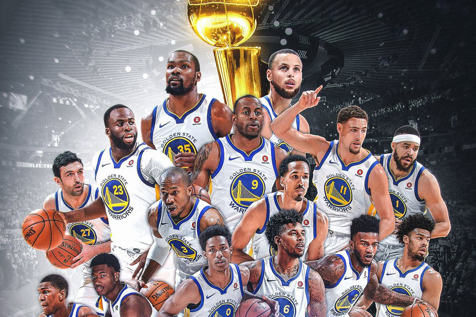

workout01-luanne-yang
================
Luanne Yang
March 2, 2019

### Introduction

The **Golden State Warriors** are known as one of the most successful teams in the basketball world, specifically the NBA. Out of the several records that they have made, the most recent and notable one would have to be during the 2015-2016 season when the Warriors broke the NBA record for most wins in a regular season by winning a total of 73 games with only 9 losses 1. Sadly, the Warriors did not win the championship in 2015-2016, but they did win the following 2016-2017 season. Many of the Warriors' success during the season could be attributed to its amazingly talented players. Most notably, **Klay Thompson, Draymond Green, Kevin Durant, Stephen Curry, and Andre Iguodala**.

### Background

The Golden State Warriors are an American professional basketball team that participates in the Nation Basketball Association, which is an all men's basketball league. Each year, the Association holds a championship among basketball teams from all over America. NBA players are some of the most paid athletes in the world 2.

------------------------------------------------------------------------

For those who are unfamiliar with the sport, basketball is a sport played by two teams of 12, where only 5 players can play at a time. The main goal of the game is get the ball in the opponent’s hoop. By NBA (National Basketball Association) standards, each game is played for 48 minutes split into 4 periods/quarters of 12 minutes. At the end of the game, the team that scored the most points wins. A player scores a point if he puts the ball through the opposition’s hoop. Points can go from one up to three. A team scores one point if a player makes a a successful free throw, two points (called a two pointer or a two point field goal) if the player scores before the two-point line, three points (three pointer or a three point field goal) if the player makes a shot from behind the three-point line 3. The three-point line is a semi-circle drawn on the court; the arc has a radius of approximately 23 ft. from the middle of the basket 4.

Each player on a basketball team has a role. For the Warriors, Stephen Curry was the point guard, Kevin Durant and Draymond Green were the power forwards, Andre Iguodala was the small forward, and Klay Thompson was the shooting guard. The point guard is responsible for dribbling and passing the ball. He must both avoid the opponents and move the ball to the opposite side of the court. In defensive, the point guard is accountable for disrupting the opponents' ball handling. The shooting guard is responsible for most of the shooting. This player should be able to shoot from anywhere on the court. Just like the shooting guard, the small forward must also have the ability to shoot from anywhere on the court, but he should also be able to do everything on a basketball court. Lastly, the power forward is the player who plays close to the basketball hoop and scores the most two pointers 5.

### Data

The data for this report is from the 2016-2017 season. Five raw data sets are used in this report, where each set represents a player’s shot statistic. Every row is an attempted shot the player made, accompanied with the period it was attempted in, as well as the minutes and seconds remaining in the period after the shot. The data sets also include the coordinates where the player made the shot, the type of field goal (two pointer or three pointer), the basketball move made, and whether the shot was successful or not.

A look through each player’s data sets shows that not every player attempted the same number of shots, but does more shots guarantee more shots made? And does more shots make a player more effective in the team?

### Analysis

Above is an image of all five players' shots charts. Each dot on the chart represents where a player attempted a shot. A successful shot is colors blue and a failed shot is colored red.

From the shot charts, all the players made a wide variety of shots. Out of all five players, Stephen Curry and Klay Thompson shot the most, which is reasonable given their positions. As the point guard, Curry’s role was to advance the ball pass the opposing defense and across the court, where he would have the perfect opportunity for a scoring a point. Klay Thompson's role as the shooting guard meant that he would be doing most of the shooting on the team. As power forwards, both Draymond Green and Kevin Durant did a fair amount of shooting from inside the three-pointer line. However, many of Draymond’s shots tend to be at the three pointer line or very close to the hoop while Kevin Durant shoots at a more variety of distances. While both are power forwards, their play styles are quiet different. The player with the least number of shots is Andre Iguodala, but the shot chart does support the assumption that Iguodala, as the small forward, is able to shoot from any distance.

At this point, it is easy to conclude that Curry, Thompson, and Durant were the better shooters. If they are shooting most of the times, then that means their teammates know that they have a higher chance at making the shot. There can be many reasons for this. One is that their positions allowed them to get more shots than others. Another may be that they are just more skilled in shooting. However, a closer look at the numbers gives a different perspective.

The table below displays the overall (including two point field goals and three point field goals) effective shooting percentage of all five players. It includes the total number of shots made by each player (labeled "TotalShots"), the number of shots made (labeled "ShotsMade"), and a percentage of shots made out of the total shots (labeled "PercentMade").

#### Effective Shooting % by Players

| Name           |  TotalShots|  ShotsMade|  PercentMade|
|:---------------|-----------:|----------:|------------:|
| Kevin Durant   |         915|        495|     54.09836|
| Andre Iguodala |         371|        192|     51.75202|
| Klay Thompson  |        1220|        575|     47.13115|
| Stephen Curry  |        1250|        584|     46.72000|
| Draymond Green |         578|        245|     42.38754|

Out of a total of 1250 shots, Curry made approximately 46.72% of the shots. Klay Thompson was not far behind Curry. During the season, he made a total of 1220 shots with a 47.13% success rate. Green made 578 shots with an accuracy of 42.39% and Durant made 915 shots with an accuracy of 54.10%. Second only to Durant, Iguodala scored 51.75% of the his shots. Even though Curry and Thompson appeared to have contributed the most to the team, in reality, neither of them had a shot percentage over 50%. While Iguodala, who did not shoot as often during the season, had a higher accuracy than both Curry and Thompson. From this data, it is clear that more shots do not lead to more shots made, but a player's shot accuracy can also be determined by the shot type they were aiming for. There are two shot types, the two point field goal and the three point field goal.

The table below displays the two point field goal effective shooting percentage of all five players. It includes the same labels as the overall effective shooting table.

#### 2PT Effective Shooting % by Players

| Name           |  TotalShots|  ShotsMade|  PercentMade|
|:---------------|-----------:|----------:|------------:|
| Andre Iguodala |         210|        134|     63.80952|
| Kevin Durant   |         643|        390|     60.65319|
| Stephen Curry  |         563|        304|     53.99645|
| Klay Thompson  |         640|        329|     51.40625|
| Draymond Green |         346|        171|     49.42197|

Looking at the data for two point field goal, Durant and Thompson attempted the most shots. Durant threw a total of 643 shots, making 60.65% of the shots. Thompson made 51.40% of his total 640 shots. Iguodala had the least amount of two point field goals, but the highest shot percentage of 63.81% out of 210 shots. Curry and Thompson were in the middle, both with over 50% shot accuracy. Green had the lowest shot percentage of 49.42%.

The table below displays the three point field goal effective shooting percentage of all five players. Once again, it includes the same labels as the overall effective shooting table.

#### 3PT Effective Shooting % by Players

| Name           |  TotalShots|  ShotsMade|  PercentMade|
|:---------------|-----------:|----------:|------------:|
| Klay Thompson  |         580|        246|     42.41379|
| Stephen Curry  |         687|        280|     40.75691|
| Kevin Durant   |         272|        105|     38.60294|
| Andre Iguodala |         161|         58|     36.02484|
| Draymond Green |         232|         74|     31.89655|

The data for three point field goals shows that Curry had the most attempted shots, followed closely by Thompson. On top of having the most total shots, both players also had the highest shot percentages. Thompson with a percent of 42.41% out of 580 total shots and Curry with a percent of 40.76% out of 687 total shots. Iguodala had the lowest total number of shots, but Green, once again, had the lowest shot percentage of 31.89%. So far, the two field goal effective shooting percentage tables have provided a clear distinction between players based on their shooting specialties. Iguodala and Durant are good at two point field goals. On the other hand, Thompson and Curry specialize in three point field goals. The next table gives further evidence of this.

The table below that displays the percentage of two point field goals (labeled "TwoPoint") and three point field goals (labeled "ThreePoint") from each player's total number of shots. In addition, it also lays out the percentage of each shot type made out of the total number of shots (labeled "TwoPointMade" and "ThreePointMade").

#### Shot Type Total and Made % by Players

| Name           |  TwoPoint|  TwoPointMade|  ThreePoint|  ThreePointMade|
|:---------------|---------:|-------------:|-----------:|---------------:|
| Andre Iguodala |  56.60377|      69.79167|    43.39623|        30.20833|
| Draymond Green |  59.86159|      69.79592|    40.13841|        30.20408|
| Kevin Durant   |  70.27322|      78.78788|    29.72678|        21.21212|
| Klay Thompson  |  52.45902|      57.21739|    47.54098|        42.78261|
| Stephen Curry  |  45.04000|      52.05479|    54.96000|        47.94521|

From the table, Curry clearly favored the three point field goals. He attempted about 9% more three point field goals than two point field goal and almost 50% of his successful shots were three point field goals. Other than Curry, all other players predominantly stuck with the two point field goals. Thompson is the closest to Curry. Nearly 50% of his total shots were made behind the three point line. Durant had an overwhelming bias for two point field goals. 70% of his total shots and 78% of his total shots made were within the three point line. This makes sense because Durant was a power forward, a player that sticks close to the hoop. Therefore, it stands to reason that he would make be making more shots from a closer distance to the hoop. Iguodala and Green also shot mostly two point field goals.

### Conclusion

In conclusion, while some players had more attempted shots than others, more shots do not lead to more shots made. Andre Iguodala is an ideal example of this. He had the least number of shots but had a higher shot made percentage than players such as Stephen Curry, who had the highest number of shots and shots made. Another example is Draymond Green, who threw more shots than Iguodala, but had the lowest overall accuracy among all the five players. However, this does not mean Draymond Green played any less of a role in his teams success during the 2016-2017 season. What he lacks in offense or scoring points, Green makes up for it by preventing the opponents from scoring. Green was in fact given the Defensive Player of the Year Award at the NBA Awards 2.

Basketball may seem like an offensive sport, but there is more to it than just scoring points. Each player has a role in a basketball team. With Green as defense, Curry and Thompson as three point shooters, and Durant and Iguodala as two point shooters, it is no wonder the Warriors is one of the most successful basketball team in NBA history.

### Reference

1.  <https://en.wikipedia.org/wiki/2015%E2%80%9316_Golden_State_Warriors_season>
2.  <https://en.wikipedia.org/wiki/National_Basketball_Association#Championships>
3.  <http://www.rulesofsport.com/sports/basketball.html>
4.  <http://www.nba.com/analysis/rules_1.html?nav=ArticleList>
5.  <https://www.basketballforcoaches.com/basketball-positions/>
